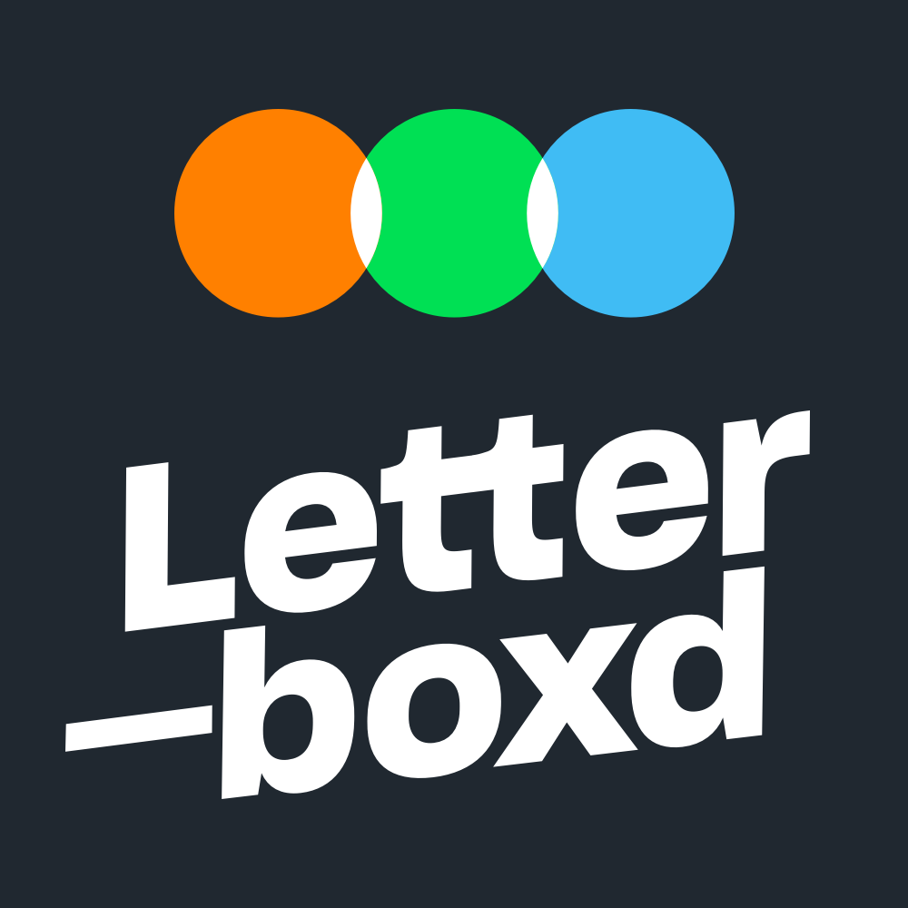

# letterboxd2notion

  
  

Inspired by [@kach0w](https://github.com/kach0w/letterbox-to-notion).

## Setup

1. Get a token for Notion at [here](https://notion.so/my-integrations)
2. Set up a database with the following fields: title (text), rating (text), year (text), movie URL (URL)
3. Grab its ID (i.e., the first UUID in the URL)
4. Get an API key from [TheMovieDB](https://themoviedb.org)
5. Set up a `.env` following `.env.example`

### Finding your Notion database ID

Copy the link to your database page that will look like: `https://www.notion.so/<long_hash_1>?v=<long_hash_2>` then choose `<long_hash_1>`, this is the database ID.

## Usage

1. `gh repo clone michaelfromyeg/letterboxd2notion`
2. `cd letterboxd2notion`
3. `python3.12 -m venv env`
4. `source env/bin/activate`
5. `pip install --upgrade pip`
6. `pip install -r requirements.txt`
7. `make run`
    - You can also run it via Windows Task Scheduler (use the `.bat` file) or on a related service (e.g., as a `cronjob`)
